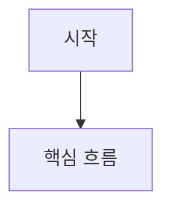

# prd-writer

한 줄 설명: 기능 아이디어나 요구사항을 근거 기반의 정밀 PRD로 구조화하는 스킬이다.

## 언제 사용해야 하는지

- 기능 아이디어는 있으나 팀이 리뷰할 수 있는 정식 PRD 구조가 아직 없을 때
- 회의 메모, 슬랙 대화, 정책 변경, VOC, 기존 기능 자료를 정식 요구사항 문서로 바꿔야 할 때
- 개발 착수 전에 목표, 범위, 성공 기준, 운영 제약을 명확히 합의해야 할 때
- 사용자 흐름, 예외 처리, 상태 전이가 복잡해 텍스트만으로 이해가 어려울 때
- 기획, 디자인, 프론트엔드, 백엔드, QA가 같은 문서를 기준으로 논의해야 할 때

## 먼저 읽어야 할 reference

- 정밀 PRD 전체 템플릿이 필요하면 [references/prd-template.md](./references/prd-template.md)
- 출처, 근거, 가정 구분 기준이 필요하면 [references/evidence-guidelines.md](./references/evidence-guidelines.md)
- Mermaid 사용 여부와 다이어그램 종류를 판단해야 하면 [references/diagram-guidelines.md](./references/diagram-guidelines.md)
- 정보가 모호해 어떤 질문을 먼저 해야 할지 판단해야 하면 [references/clarification-checklist.md](./references/clarification-checklist.md)

## 기본 동작 규칙

- 정보가 충분하면 바로 PRD를 작성한다.
- 정보가 부족하거나 충돌하면 바로 PRD를 확정하지 말고, 먼저 사용자에게 구체적인 명확화 질문을 한다.
- 질문은 열린 추상 질문보다 문서를 완성하는 데 직접 필요한 항목 위주로 한다.
- 질문 후에도 답이 없으면 사실을 지어내지 말고 `가정`과 `오픈 이슈`로 최소 범위만 정리한다.
- 입력으로 주어지지 않은 링크, 문서, 정책, 수치, 근거는 임의로 만들지 않는다.

## 언제 질문을 먼저 해야 하는지

아래 항목 중 하나라도 비어 있거나 서로 충돌하면, PRD 초안 작성 전에 질문을 우선한다.

- 해결하려는 문제
- 대상 사용자
- 이번 범위와 제외 범위
- 성공 기준 또는 기대 효과
- 정책, 보안, 운영 제약
- 기존 기능과의 관계
- 참고해야 할 문서, 회의 메모, API 계약

### 질문 규칙

- 한 번에 모든 것을 묻지 말고, 문서 품질에 가장 큰 영향을 주는 항목부터 우선순위대로 묻는다.
- `누가 사용자야?`처럼 너무 넓은 질문보다 `가맹점주와 운영자 중 이번 기능의 1차 대상은 누구야?`처럼 구체적으로 묻는다.
- 답변을 기다릴 수 없으면, `가정`과 `오픈 이슈`로 문서화하고 확정 표현은 피한다.

## 입력으로 기대하는 정보

### 필수

- 기능명 또는 작업명
- 해결하려는 문제 또는 현재 불편
- 왜 지금 필요한지에 대한 배경

### 권장

- 대상 사용자와 사용 상황
- 기대 효과 또는 비즈니스 목표
- 관련 정책, 보안, 운영 제약
- 일정, 우선순위, 마감 맥락
- 참고할 기존 기능, 경쟁 사례, 회의 메모
- API 계약, 와이어프레임, 화면 캡처, VOC, 데이터 리포트

### 입력이 부족할 때 처리 규칙

- 근거 없는 내용을 확정하지 말고 `가정` 또는 `오픈 이슈`로 분리한다.
- 숫자 목표가 없으면 임의 수치를 만들지 말고 측정 후보를 제안한다.
- 구현 방식이 정해지지 않았으면 솔루션 확정보다 문제와 사용자 맥락을 먼저 정리한다.
- 중요한 축이 모호하면 먼저 질문하고, 질문 없이 성급하게 문서를 완성하지 않는다.

## 반드시 포함해야 하는 출력 형식

항상 아래 템플릿 순서로 마크다운을 작성한다.

````md
# PRD: [기능명]

## 1. 문제 정의
- 현재 상황:
- 불편 또는 리스크:
- 왜 지금 필요한가:

## 2. 목표 / 비목표
### 목표
- ...

### 비목표
- ...

## 3. 대상 사용자
| 사용자군 | 현재 상황 | 해결하려는 일 |
| --- | --- | --- |
| ... | ... | ... |

## 4. 유저 시나리오
1. [사용자]는 [상황]에서 [목적]을 위해 [행동]한다.
2. [사용자]는 [조건]일 때 [기대 결과]를 원한다.

## 5. 흐름 다이어그램 (선택)


다이어그램 설명: 이 다이어그램이 어떤 흐름, 분기, 상태 변화를 설명하는지 1~2줄로 적는다.

## 6. 기능 요구사항
| ID | 요구사항 | 우선순위 | 근거 | 비고 |
| --- | --- | --- | --- | --- |
| FR-1 | ... | Must | Ref-1 | ... |

## 7. 비기능 요구사항
| ID | 항목 | 요구사항 | 근거 |
| --- | --- | --- | --- |
| NFR-1 | 성능/보안/로그/접근성 등 | ... | Ref-2 |

## 8. 성공 지표
| 지표 | 정의 | 측정 방식 | 목표 | 근거 |
| --- | --- | --- | --- | --- |
| ... | ... | ... | ... | Ref-3 |

## 9. 참고 자료 / 근거
| ID | 구분 | 출처 | 반영 내용 |
| --- | --- | --- | --- |
| Ref-1 | 회의 메모 / 기존 기능 / 정책 / API 문서 / VOC / 데이터 등 | ... | ... |

## 10. 가정
| ID | 가정 | 필요한 확인 | 영향도 |
| --- | --- | --- | --- |
| A-1 | ... | ... | 높음/중간/낮음 |

## 11. 오픈 이슈
- [ ] 확인이 필요한 항목
- [ ] 의사결정이 필요한 항목

## 12. 다음 액션
| 액션 | 담당 역할 | 기대 산출물 | 우선순위 |
| --- | --- | --- | --- |
| ... | ... | ... | ... |
````

### 출력 규칙

- `문제 정의`에는 현상, 원인 추정, 미해결 시 리스크를 분리해서 적는다.
- `목표`는 달성하고 싶은 상태를 적고, `비목표`는 이번 범위 밖 항목을 명확히 적는다.
- `기능 요구사항`은 구현 지시문이 아니라 사용자 가치 기준으로 작성한다.
- 요구사항은 `FR-1`, `FR-2`처럼 ID를 붙인다.
- `비기능 요구사항`에는 성능, 보안, 로그, 접근성, 운영 관점 누락이 없도록 본다.
- `성공 지표`가 불명확하면 최소한 관찰 가능한 선행 지표를 적는다.
- `참고 자료 / 근거`에는 실제 입력으로 받은 문서, 메모, 링크, 정책, 데이터만 적는다.
- `가정`에는 근거가 부족하지만 문서 진행을 위해 임시로 둔 판단만 적는다.
- `다음 액션`은 담당 역할이 보이도록 작성한다.

## 참고 자료 / 근거 작성 규칙

- 근거 ID는 `Ref-1`, `Ref-2`처럼 순서대로 붙인다.
- 가능한 경우 `기능 요구사항`, `비기능 요구사항`, `성공 지표`에 근거 ID를 연결한다.
- 사용자 시나리오와 문제 정의도 근거가 명확하면 문장 끝에 `(Ref-1)`처럼 연결할 수 있다.
- 실제 입력에 없는 링크, 문서 제목, 정책 이름은 만들지 않는다.

## 가정 작성 규칙

- 가정 ID는 `A-1`, `A-2`처럼 순서대로 붙인다.
- 가정은 확정 사실처럼 본문에 섞지 않는다.
- 영향도가 높은 가정은 `오픈 이슈`와 `다음 액션`에도 연결한다.

## Mermaid 사용 규칙

- 기본은 미포함이다.
- 아래 조건 중 하나 이상이면 `흐름 다이어그램` 섹션을 추가한다.
  - 사용자 흐름이 복잡하다.
  - 예외 처리 또는 분기 흐름이 중요하다.
  - 상태 전이가 핵심이다.
  - 시스템 간 상호작용 설명이 필요하다.
- 허용 다이어그램 타입은 아래 셋을 기본값으로 사용한다.
  - 사용자 흐름: `flowchart TD`
  - 시스템 상호작용: `sequenceDiagram`
  - 상태 변화: `stateDiagram-v2`
- 다이어그램은 장식이 아니라 이해를 돕는 용도로만 넣는다.
- 기본적으로 하나의 PRD에는 다이어그램 1개만 넣고, 꼭 필요할 때만 추가한다.

## 작업 절차

1. 입력 내용을 읽고 문제, 대상 사용자, 기대 효과, 참고 자료 유무를 먼저 추린다.
2. [references/clarification-checklist.md](./references/clarification-checklist.md)를 기준으로, 바로 작성 가능한지 먼저 판단한다.
3. 해결하려는 문제, 대상 사용자, 범위, 성공 기준, 제약이 모호하면 PRD 초안 작성 전에 구체적인 질문을 먼저 한다.
4. 정밀 템플릿이 필요하면 [references/prd-template.md](./references/prd-template.md)를 기준으로 섹션을 채운다.
5. 근거와 가정이 섞이지 않도록 [references/evidence-guidelines.md](./references/evidence-guidelines.md)를 기준으로 분리한다.
6. 사용자 흐름이나 상태 변화가 복잡하면 [references/diagram-guidelines.md](./references/diagram-guidelines.md)를 참고해 Mermaid를 추가한다.
7. 기능 요구사항은 우선순위와 근거를 붙이고, 비기능 요구사항은 운영상 필요한 항목까지 확인한다.
8. 숫자 목표가 있으면 성공 지표로 정리하고, 없으면 측정 가능한 후보를 제안한다.
9. 아직 결정되지 않은 내용은 `오픈 이슈`로 분리하고, 바로 다음 논의나 작업을 `다음 액션`에 적는다.

## 품질 체크리스트

- 문서 첫 부분만 읽어도 왜 필요한 기능인지 이해할 수 있는가
- 목표와 비목표가 섞여 있지 않은가
- 대상 사용자와 유저 시나리오가 실제 상황에 맞게 구체적인가
- 기능 요구사항이 구현 세부보다 사용자 행동과 결과 중심으로 작성되었는가
- 비기능 요구사항에 운영상 필요한 항목이 빠지지 않았는가
- 성공 지표가 측정 가능한 표현으로 작성되었는가
- 모든 핵심 주장에 근거 또는 가정이 연결되었는가
- 근거가 부족한 내용이 사실처럼 적히지 않았는가
- Mermaid가 장식이 아니라 실제 이해 보조 역할을 하는가
- 미정 항목이 본문에 섞이지 않고 `오픈 이슈`로 분리되었는가
- 다음 액션이 역할 기준으로 바로 실행 가능한가

## 예시 요청

- `결제 완료 후 카카오톡 알림 기능 아이디어를 PRD 초안으로 정리해줘. 대상 사용자는 소상공인 가맹점주이고, 빠른 입금 확인이 목적이야.`
- `아래 회의록과 기존 운영 정책을 참고해서 환불 승인 프로세스 개선 PRD를 작성해줘. 근거와 가정을 분리해줘.`
- `회원 상태 변경 기능의 흐름이 복잡해. PRD를 작성하되 필요하면 Mermaid 다이어그램도 넣어줘.`
- `상담 이력 검색 기능 요구사항 메모를 PRD 형식으로 바꿔줘. 모호한 점이 있으면 먼저 질문해줘.`
- `아래 API 계약 변경 메모, VOC, 화면 캡처를 참고해서 관리자 어드민 개선 PRD를 작성해줘. 성공 지표와 오픈 이슈까지 포함해줘.`
