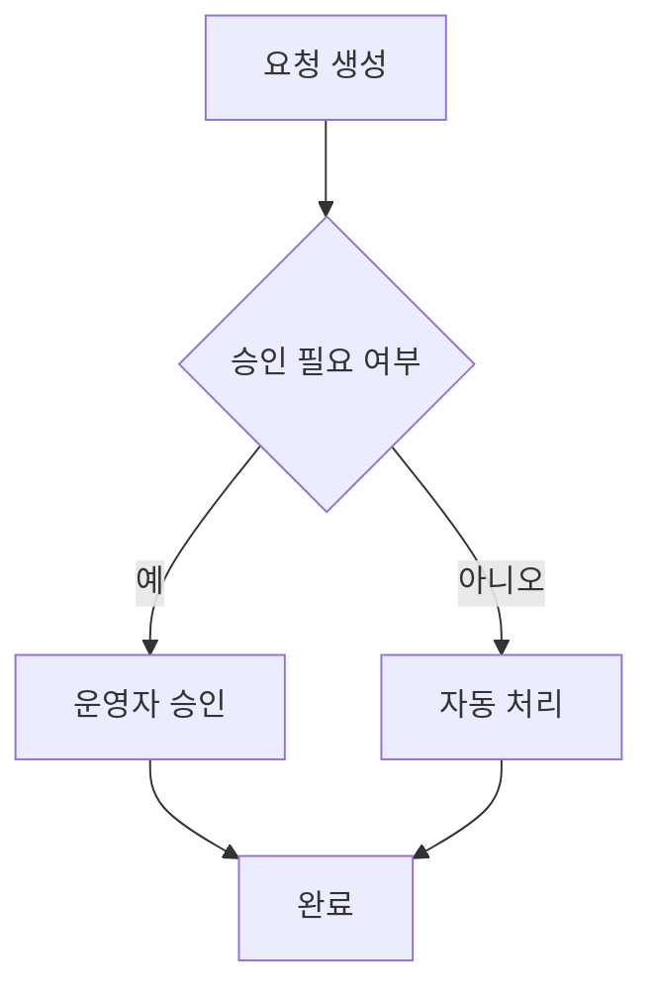
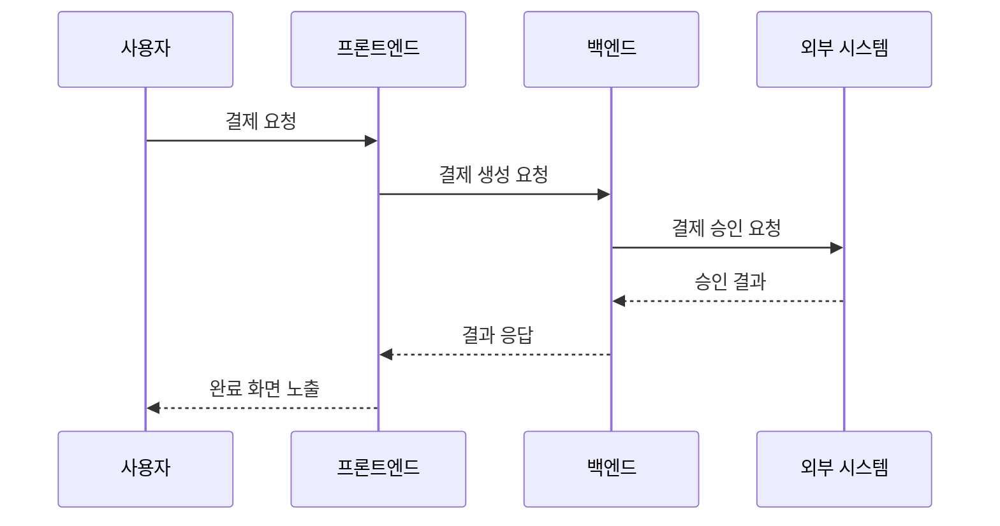
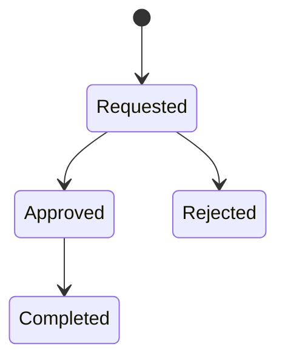

# Mermaid 다이어그램 가이드

이 문서는 `prd-writer`가 Mermaid를 언제 넣고 어떤 타입을 선택할지 판단할 때 참고한다.

## 기본 원칙

- Mermaid는 기본적으로 넣지 않는다.
- 텍스트만으로 전달이 어려운 경우에만 추가한다.
- 장식 목적의 다이어그램은 넣지 않는다.
- 한 PRD에 기본적으로 다이어그램 1개만 사용한다.

## Mermaid를 넣는 경우

- 사용자 흐름이 3단계 이상으로 길다.
- 조건 분기나 예외 흐름이 중요하다.
- 상태 전이가 핵심이다.
- 시스템 또는 역할 간 상호작용 설명이 필요하다.

## Mermaid를 넣지 않는 경우

- 요구사항이 단순하고 직선적이다.
- 이미 텍스트 시나리오만으로 충분히 전달된다.
- 다이어그램을 넣어도 추가 정보가 거의 없다.

## 추천 다이어그램 타입

### `flowchart TD`

사용자 흐름, 승인 플로우, 예외 분기 설명에 사용한다.

### `sequenceDiagram`

사용자, 프론트엔드, 백엔드, 외부 시스템 간 상호작용 설명에 사용한다.

### `stateDiagram-v2`

주문 상태, 승인 상태, 환불 상태처럼 상태 변화가 핵심일 때 사용한다.

## 작성 규칙

- 다이어그램 아래에 1~2줄 설명을 반드시 붙인다.
- 노드 이름은 문서 독자가 바로 이해할 수 있게 쓴다.
- 구현 상세보다 비즈니스 흐름 중심으로 그린다.
- 다이어그램만 보고도 핵심 분기와 종료 상태를 이해할 수 있어야 한다.
