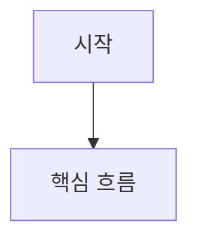

# 정밀 PRD 템플릿

이 문서는 `prd-writer`가 정밀 PRD를 작성할 때 참고하는 상세 템플릿이다.

## 사용 시점

- 기본 템플릿보다 더 정교한 구조가 필요할 때
- 여러 문서와 회의 메모를 통합해 PRD를 작성할 때
- 근거, 가정, 흐름 다이어그램까지 포함한 문서가 필요할 때

## 템플릿

````md
# PRD: [기능명]

## 1. 문제 정의
- 현재 상황:
- 불편 또는 리스크:
- 왜 지금 필요한가:

## 2. 목표 / 비목표
### 목표
- ...

### 비목표
- ...

## 3. 대상 사용자
| 사용자군 | 현재 상황 | 해결하려는 일 |
| --- | --- | --- |
| ... | ... | ... |

## 4. 유저 시나리오
1. [사용자]는 [상황]에서 [목적]을 위해 [행동]한다.
2. [사용자]는 [조건]일 때 [기대 결과]를 원한다.

## 5. 흐름 다이어그램 (선택)


다이어그램 설명: 이 다이어그램이 어떤 흐름, 분기, 상태 변화를 설명하는지 적는다.

## 6. 기능 요구사항
| ID | 요구사항 | 우선순위 | 근거 | 비고 |
| --- | --- | --- | --- | --- |
| FR-1 | ... | Must | Ref-1 | ... |

## 7. 비기능 요구사항
| ID | 항목 | 요구사항 | 근거 |
| --- | --- | --- | --- |
| NFR-1 | 성능/보안/로그/접근성 등 | ... | Ref-2 |

## 8. 성공 지표
| 지표 | 정의 | 측정 방식 | 목표 | 근거 |
| --- | --- | --- | --- | --- |
| ... | ... | ... | ... | Ref-3 |

## 9. 참고 자료 / 근거
| ID | 구분 | 출처 | 반영 내용 |
| --- | --- | --- | --- |
| Ref-1 | 회의 메모 / 기존 기능 / 정책 / API 문서 / VOC / 데이터 등 | ... | ... |

## 10. 가정
| ID | 가정 | 필요한 확인 | 영향도 |
| --- | --- | --- | --- |
| A-1 | ... | ... | 높음/중간/낮음 |

## 11. 오픈 이슈
- [ ] 확인이 필요한 항목
- [ ] 의사결정이 필요한 항목

## 12. 다음 액션
| 액션 | 담당 역할 | 기대 산출물 | 우선순위 |
| --- | --- | --- | --- |
| ... | ... | ... | ... |
````

## 섹션별 목적

- `문제 정의`: 현상, 리스크, 시급성을 설명한다.
- `목표 / 비목표`: 이번 문서 범위를 명확히 고정한다.
- `대상 사용자`: 문서가 누구를 위한 것인지 분명히 한다.
- `유저 시나리오`: 요구사항보다 먼저 사용자 흐름을 설명한다.
- `흐름 다이어그램`: 텍스트만으로 전달이 어려운 흐름을 보조한다.
- `기능 요구사항`: 사용자 가치 기준으로 기능을 정의한다.
- `비기능 요구사항`: 성능, 보안, 접근성, 로그, 운영 등 기술 외 필수 조건을 고정한다.
- `성공 지표`: 출시 후 무엇을 기준으로 성공을 판단할지 정한다.
- `참고 자료 / 근거`: 어떤 입력과 문서를 바탕으로 썼는지 드러낸다.
- `가정`: 아직 확정되지 않았지만 문서를 진행하기 위해 둔 임시 판단을 분리한다.
- `오픈 이슈`: 반드시 확인해야 할 항목을 남긴다.
- `다음 액션`: 실제 후속 작업으로 이어지게 한다.

## 작성 규칙

- 기능 요구사항은 구현 상세보다 사용자 행동과 결과 중심으로 적는다.
- 근거가 있는 항목은 `Ref-*`와 연결한다.
- 근거가 부족한 항목은 `가정`이나 `오픈 이슈`로 보낸다.
- 다이어그램은 필요할 때만 사용한다.
